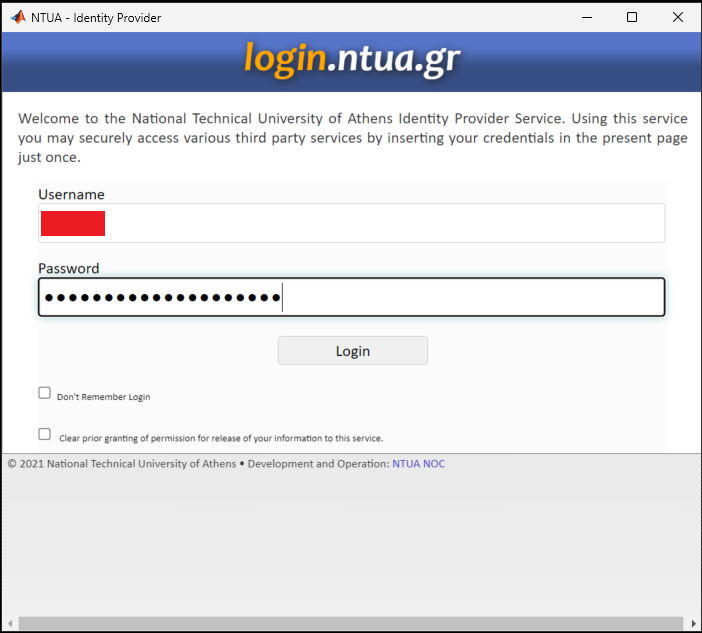

# <!-- fit --> Σχολή Πολιτικών Μηχανικών Ε.Μ.Π.

### Εργαστήριο Ψηφιακής Τεχνολογίας για Τεχνικά Έργα

### Οδηγίες εγκατάστασης της ιδρυματικής άδειας του MATLAB

---

Πλοηγηθείτε στη σελίδα [https://mathworks.com/login](https://mathworks.com/login), πληκτρολογήστε το email σας στο ΕΜΠ και πατήστε το κουμπί “Next”.

---

Θα ανακατευθυνθείτε στο `login.ntua.gr` όπου θα πρέπει να συμπληρώσετε το username και το password που χρησιμοποιείτε στις ηλεκτρονικές υπηρεσίες του ΕΜΠ.

---

Αν δέχεστε το Online Services Agreement της Mathworks πατήστε στο κουμπί “Accept”.

---

Επιλέξτε Matlab (Individual).

---

Επιλέξτε “I want to install products” και στη συνέχεια πατήστε το κουμπί “Download for <το λειτουργικό σας>”.

---

Σώστε το αρχείο της εγκατάστασης κάπου στο δίσκο σας.

---

Ξεκινάει το download του αρχείου εγκατάστασης.

---

Το download του αρχείου εγκατάστασης ολοκληρώθηκε. Κάντε διπλό κλίκ πάνω του για να ξεκινήσει η εγκατάσταση.

---

Για να αρχίσει η εγκατάσταση δώστε το email σας στο ΕΜΠ

---

Θα μεταφερθείτε στον έλεγχο πρόσβασης του ΕΜΠ

---

Δώστε το μυστικό σας κωδικό (password)

---

Πατήστε Accept

---

Επιλέξτε Yes και Next

---

Κάντε την επιλογή Matlab (Individual)

---

Επιλέξτε που θα εγκατασταθεί το πρόγραμμα

---

Επιλέξτε μόνο τα απαραίτητα! Όλες οι επιλογές θα καταλάβουν πολύ χώρο στο δίσκο σας!

Μπορείτε να επανέλθετε αργότερα και να εγκαταστήσετε και άλλα toolboxes όταν τα χρειαστείτε.

---

Πατήστε Next

---

Πατήστε Begin Installation

---

Η εγκατάσταση ξεκίνησε

---

Η εγκατάσταση ολοκληρώθηκε

---

Πατήστε Close

---

Ξεκινήστε ξανά το Matlab και για άλλη μια (τελευταία) φορά θα πρέπει να δώσετε το email σας στο ΕΜΠ

---

Θα μεταφεθείτε στον έλεγχο πρόσβασης του ΕΜΠ

---

Δώστε το μυστικό σας κωδικό (password)

---

Πατήστε Accept

---

To Matlab ξεκινά

---

Το Matlab είναι έτοιμο προς χρήση.

---

# Ανανέωση της πρόσβασης στα τέλη Ιουλίου κάθε έτους

Κάθε χρόνο, τέλη Ιουλίου, η πρόσβαση στην Ιδρυματική άδεια του Matlab λήγει.

**Προκειμένου να ανανεώσετε την πρόσβαση σας στην άδεια του Matlab θα πρέπει να κάνετε ξανά login στον Ιδρυματικό σας λογαριασμό χρησιμοποιώντας το μενού στην πάνω δεξιά γωνία του παραθύρου του Matlab.**

Με αυτόν τον τρόπο επιβεβαίωνετε την ιδιότητά σας ως μέλος του ΕΜΠ και ανανεώνετε την πρόσβαση σας στην άδεια του Matlab.
